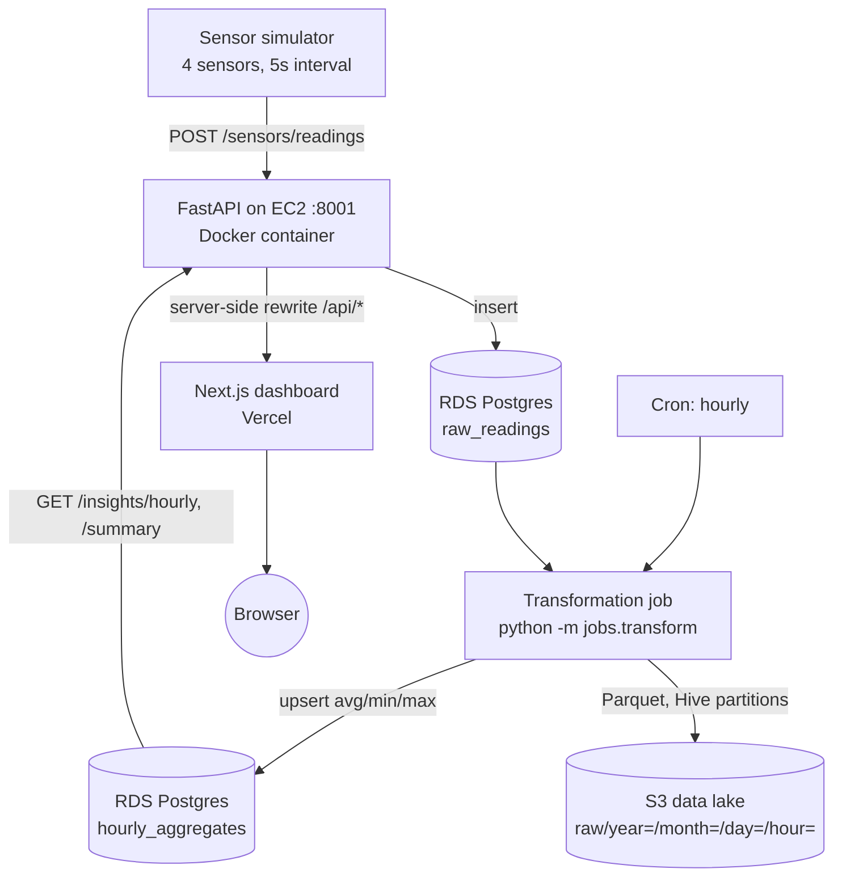

# Architecture — Sensor Data Pipeline

Week 8 capstone. One page: what the pieces are, how a reading flows through
them, and why it's shaped this way.

## The picture

```
[Sensor Simulator]  --POST readings-->  [Ingestion API (FastAPI, EC2/Docker :8001)]
                                                |
                                                v
                                      [RDS Postgres: raw_readings]
                                                |
                                                v
                              [Transformation job: hourly aggregates (cron)]
                                    /                        \
                                   v                          v
                        [S3 data lake: Parquet]      [RDS: hourly_aggregates]
                                                                |
                                                                v
                                              [Analytics API: /insights/*  (same FastAPI)]
                                                                |
                                                     server-side /api proxy
                                                                |
                                                                v
                                          [Dashboard (Next.js on Vercel)]
```



## Components

| Component | Tech | Runs where | Why this choice |
|---|---|---|---|
| Sensor simulator | Python + requests (stdlib otherwise) | Docker service beside the API | Continuous "live" data during the demo; survives API restarts |
| Ingestion + analytics API | FastAPI, layered (router → service → repository → model) | EC2, Docker, host port **8001** | Same structure and CI/CD as `employee-management-api` (port 8000) — proven in Weeks 3–7 |
| Raw store | RDS Postgres, `sensor_db` database | Existing RDS instance | New database on the same instance: zero new infra, zero risk to `employee_db` |
| Transformation job | `python -m jobs.transform`, pandas | Cron inside the API container | Reuses the container's deps + DB URL; idempotent so retries are safe |
| Data lake | S3, Parquet, Hive-style partitions | `s3://<bucket>/raw/year=/month=/day=/hour=/` | Columnar + partitioned = queryable later by Athena/Glue without reprocessing |
| Analytics store | `hourly_aggregates` table in RDS | Same `sensor_db` | Insights queries hit small pre-aggregated rows, never the raw table |
| Dashboard | Next.js + recharts | Vercel | The curriculum's deployment URL; polls `/insights/*` every 10–60s |

## Life of a reading

1. The simulator computes a value on a daily sine cycle + noise and POSTs
   `{sensor_id, sensor_type, value}` to `/sensors/readings`.
2. Pydantic validates at the edge: unknown types and physically impossible
   values are rejected with a 422 before touching the DB.
3. The service fills server-side fields (canonical unit, `recorded_at` if the
   device sent none) and the repository inserts into `raw_readings`. The row
   carries both `recorded_at` (device clock) and `ingested_at` (server clock)
   so late-arriving data is still attributed to the right hour.
4. Five minutes past each hour, cron runs the transformation job for the last
   completed hour: avg/min/max/count per sensor → **upsert** into
   `hourly_aggregates` (unique on `sensor_id + hour_start`), and the raw
   batch → Parquet in S3.
5. The dashboard polls `/insights/summary` (latest value + weighted 24h
   stats) and `/insights/hourly` (chart series). Requests go through a
   server-side Next.js rewrite (`/api/*` → EC2) — see "Design decisions".

## Design decisions worth defending

- **Idempotent transformation.** The unique constraint on
  `(sensor_id, hour_start)` plus upsert semantics means a re-run (cron retry,
  late data, manual backfill) can never duplicate an aggregate — it corrects
  it. The Parquet write overwrites the same partition for the same reason.
- **Two timestamps per reading.** `recorded_at` drives aggregation windows;
  `ingested_at` records reality. Cheap now, impossible to add retroactively.
- **Server-side API proxy on Vercel.** The dashboard page is https; the EC2
  API is http. Browsers block that as mixed content. The Next.js rewrite
  (`/api/*` → `API_PROXY_TARGET`) proxies server-side, which also removes the
  need for CORS entirely.
- **Same EC2 instance, different port.** The capstone API is a second Docker
  container on :8001 next to the employee API on :8000 — no new instance,
  no new SSH/security-group surface, ~$0 marginal cost.
- **Repository pattern everywhere.** Tests swap Postgres for in-memory SQLite
  via one dependency override; the transform job's archive destination swaps
  local↔S3 via one `ArchiveSink` adapter — the same pattern that carried the
  Week 6 ETL project.

## Cost

Marginal cost over the existing Weeks 4–7 footprint: **S3 storage in the
pennies** (a few KB of Parquet per hour) and nothing else — same EC2, same
RDS instance, Vercel free tier.
